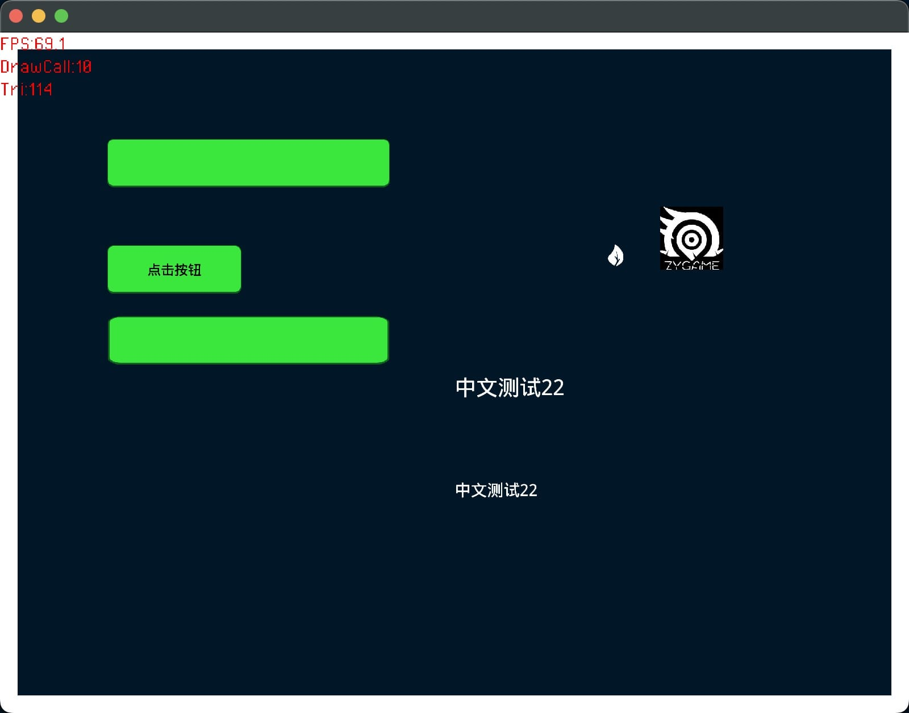

## zyheaps
- 它拥有可用的Android/IOS/Mac/Window/HTML5/小游戏等平台开箱即用的能力，同时它自身带了一个易用API，例如一些常用的组件：按钮、Spine、ttf文本等。不使用该API，仍然可以使用该库进行编译。
- It has the out of the box ability of available android/ios/mac/window/html5/ games and other platforms. At the same time, it comes with an easy-to-use API, such as some commonly used components: buttons, spine, TTF text, etc. Without using this API, you can still compile with this library.



## Record problems
The current status is open, and there will be a lot of problems to be solved.

## Development installation
```shell
haxelib git zyheaps https://github.com/rainyt/zyheaps.git
```

## Heaps版本
- 建议使用rainyt分叉的heaps版本：[https://github.com/rainyt/heaps](https://github.com/rainyt/heaps)，它兼容了IOS高DPI，触摸等问题。当[HeapsIo/heaps](https://github.com/HeapsIO/heaps)正式修正了这些问题后，将合并版本。
- It is recommended to use the rainyt forked heaps version, which is compatible with IOS, high DPI, touch and other issues. When heapsio/heaps formally fixes these problems, the version will be merged.

|  Support   | IOS  | Android | Mac | HTML5 | Window |
|  ----  | ----  | --- | --- | --- | --- |
| 默认的高DPI(High DPI)  | ✅ | ✅ | ✅ | ✅ | ✅ |
| 正常触摸(Touch)  | ✅ | ✅ | ✅ | ✅ | ✅ |
| 中文渲染TTF(Font TTF)  | ✅ | ✅ | ✅ | ✅ | ✅ |
| XML格式精灵图(Sprite XML format)  | ✅ | ✅ | ✅ | ✅ | ✅ |
| 动态加载资源(Dynamic load assets)  | ✅ | ✅ | ✅ | ✅ | ✅ |
| 编译支持(Build stats)  | ✅ | ✅ | ✅ | ✅ | ✅ |
| 异步加载(Async load) | ✅ | ✅ | ✅ | ✅ | ✅ |
| 网络请求(Network) | ✅ | ✅ | ✅ | ✅ | ✅ |
| 过渡动画(Actuate) | ✅ | ✅ | ✅ | ✅ | ✅ |
| 文件选择器(FileDialog) | ❌ | ❌ | ✅ | ✅ | ❌ |
| 输入法(IME) | ❌ | ❌ | ✅ | ✅ | check  |

## 输入法（IME）
请注意使用IME需要`rainyt/hlsdl`库支持，可通过安装：
```shell
haxelib git hlsdl https://github.com/rainyt/hlsdl.git
```

## UI Component
- [x] 色块(Quad) zygame.display.Quad
- [x] 文本(Label) zygame.display.Label （支持中文的文本组件）
- [x] 按钮(Button) zygame.display.Button
- [x] 图片/九宫格图片(Image) zygame.display.Image
- [x] 列表/列表Item(ListView) zygame.display.ListView & zygame.display.ItemRenderer
- [x] 场景管理(SceneManager) zygame.utils.SceneManager
- [x] UI自动构造器(XMLBuilder) zygame.res.XMLBuiler
- [x] 竖向排序容器(VBox) zygame.display.VBox
- [x] 横向排序容器(HBox) zygame.display.HBox
- [x] 场景(Scene) zygame.display.Scene
- [x] Spine动画(Spine) zygame.display.Spine
- [x] 进度条(Progress) zygame.display.Progress
- [x] 滚动窗口(ScrollView) zygame.display.ScrollView
- [x] 列表窗口(ListView) zygame.display.ListView
- [x] 文本输入(TextInput) zygame.display.TextInput

## Batch Component
- [x] 按钮(BButton) zygame.display.batch.BButton
- [ ] 容器(BBox) zygame.display.batch.BBox
- [x] 图片(BImage) zygame.display.batch.BImage
- [ ] 位图文字(BLabel)
- [ ] 九宫格图

## VSCode Heaps
- 你可以在VSCode的插件商店中搜索`Heaps`，进行安装插件，该插件会检测`zyheaps.xml`配置文件进行编译。
- [https://github.com/rainyt/heaps-vscode-extension](https://github.com/rainyt/heaps-vscode-extension)
- You can search 'Heaps' in the vscode plug-in store to install the plug-in, which will detect 'zyheaps.XML' configuration file.

## Document description
- [使用文档](https://github.com/rainyt/zyheaps/wiki/%E5%9F%BA%E7%A1%80%E4%BD%BF%E7%94%A8%E6%96%87%E6%A1%A3%EF%BC%88%E4%B8%AD%E6%96%87%EF%BC%89)
- [Use Document](https://github.com/rainyt/zyheaps/wiki/Use-(EN))

## 扩展支持
- Actuate:[https://github.com/openfl/actuate](https://github.com/openfl/actuate)
    - 使用内置的heaps.update进行更新，得到丝滑流畅效果。

## 第三方库版本
| 第三方库 | Mac | Window | IOS | Android |
|  ----  | ----  | --- | --- | --- |
| SDL | 2.24.0 | 2.24.0 | uncheck | uncheck |

## Project inspiration
- IOS:[https://github.com/qkdreyer/heaps-ios](https://github.com/qkdreyer/heaps-ios)
- Android:[https://github.com/altef/heaps-android](https://github.com/altef/heaps-android)
- LimeTools:[https://github.com/jgranick/lime-tools](https://github.com/jgranick/lime-tools)
- Gylyphme:[https://github.com/micomuko/glyphme](https://github.com/micomuko/glyphme)
- Mac:[https://gist.github.com/ZwodahS/1f5836f0686e856ad1ca70dfcb7ecfdb](https://gist.github.com/ZwodahS/1f5836f0686e856ad1ca70dfcb7ecfdb)